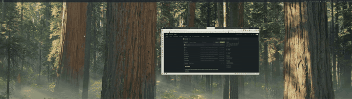

# murale

A lean, memory-safe video wallpaper player for Wayland compositors. Built with Rust and libmpv.

[](LICENSE)



## Why murale?

[mpvpaper](https://github.com/GhostNaN/mpvpaper) is the standard video wallpaper tool for Wayland, but it has well-documented problems: a [memory leak](https://github.com/GhostNaN/mpvpaper/issues/101) that grows to 7+ GB over hours, [segfaults on monitor disconnect](https://github.com/GhostNaN/mpvpaper/issues/97), and a two-process architecture that doubles resource usage.

murale fixes all of this in ~600 lines of Rust:

| | murale | mpvpaper |
|---|---|---|
| **Memory (4K HEVC, 7680x2160)** | **640 MB stable** | 7.6 GB and growing |
| **Memory leak** | None | [Yes](https://github.com/GhostNaN/mpvpaper/issues/117) |
| **Processes** | 1 | 2 (mpvpaper + mpvpaper-holder) |
| **Frame pacing (240Hz)** | 0 delayed frames | Smooth but leaking |
| **Language** | Rust | C |
| **Crash on monitor disconnect** | No | [Yes](https://github.com/GhostNaN/mpvpaper/issues/97) |

## Features

- **Wayland native** -- uses `wlr-layer-shell` for proper wallpaper surfaces
- **Hardware decode** -- `hwdec=auto` for GPU-accelerated video decode (NVDEC, VAAPI)
- **Single process** -- no holder binary, no process swapping
- **mpv IPC** -- full mpv command interface via `input-ipc-server` socket
- **Frame-perfect pacing** -- non-blocking render with compositor frame callback synchronization
- **Minimal output** -- two log lines by default, detailed stats with `--stats`

## Requirements

- A Wayland compositor with `wlr-layer-shell` support (Hyprland, Sway, river, wayfire, etc.)
- libmpv (`mpv` package on most distros)
- EGL + OpenGL (GPU drivers)
- Rust toolchain (for building)

**Note:** GNOME/Mutter does not support `wlr-layer-shell`. This is the same limitation as mpvpaper.

## Building

```bash
git clone https://github.com/brenton-keller/murale.git
cd murale
cargo build --release
```

The binary is at `target/release/murale`.

### System dependencies

**Arch Linux:**
```bash
sudo pacman -S mpv wayland wayland-protocols
```

**Debian/Ubuntu:**
```bash
sudo apt install libmpv-dev libwayland-dev libwayland-egl1 libegl-dev
```

**Fedora:**
```bash
sudo dnf install mpv-libs-devel wayland-devel wayland-protocols-devel mesa-libEGL-devel
```

## Usage

```bash
# Basic -- play a video as your wallpaper
murale ~/Videos/wallpaper.mp4

# Target a specific monitor
murale ~/Videos/wallpaper.mp4 --output DP-2

# Enable mpv's IPC socket (for external control)
murale ~/Videos/wallpaper.mp4 --mpv-options "input-ipc-server=/tmp/murale.sock"

# Monitor frame timing and playback stats
murale ~/Videos/wallpaper.mp4 --stats
```

### mpv options

Pass any mpv property via `--mpv-options` as comma-separated `key=value` pairs:

```bash
murale video.mp4 --mpv-options "hwdec=auto,input-ipc-server=/tmp/murale.sock"
```

murale sets sensible defaults: `hwdec=auto`, `loop-file=inf`, `keepaspect=yes`, `panscan=1.0` (crop-to-fill). Override any of these via `--mpv-options`.

### IPC control

With `input-ipc-server` enabled, control playback via mpv's JSON IPC:

```bash
# Switch video
echo '{"command": ["loadfile", "/path/to/new-video.mp4"]}' | socat - /tmp/murale.sock

# Pause/resume
echo '{"command": ["set_property", "pause", true]}' | socat - /tmp/murale.sock

# Check playback position
echo '{"command": ["get_property", "time-pos"]}' | socat - /tmp/murale.sock
```

This is compatible with existing mpvpaper automation scripts -- any tool that talks to mpv's IPC socket works with murale.

### Stats output

With `--stats`, murale logs frame timing every 5 seconds:

```
[stats] fps=240.0 delayed=0 vo_drops=1425 dec_drops=0 vsync_ratio=0.00 | interval avg=5.27ms min=3.01ms max=12.88ms jitter=1.78ms
```

- `delayed=0` means the GPU presented every frame on time
- `vo_drops` are intentional frame drops by mpv's display-resample (normal)
- `dec_drops=0` means the hardware decoder is keeping up

## How it works

murale creates a `wlr-layer-shell` background surface, initializes an EGL/OpenGL context, and uses libmpv's render API to draw video frames directly to that surface.

The render loop is paced by Wayland compositor frame callbacks (not EGL vsync), with mpv's `BLOCK_FOR_TARGET_TIME` set to 0 for non-blocking frame delivery. This matches the approach used by mpvpaper but with Rust's ownership model preventing the memory leaks and use-after-free bugs found in the C implementation.

## Tested on

- **Display:** Samsung Odyssey G95NC, 7680x2160 @ 240Hz
- **GPU:** NVIDIA RTX 5080, driver 580.142
- **Compositor:** Hyprland 0.54.3
- **Video:** 3840x2160 HEVC 240fps

## License

[MIT](LICENSE)
